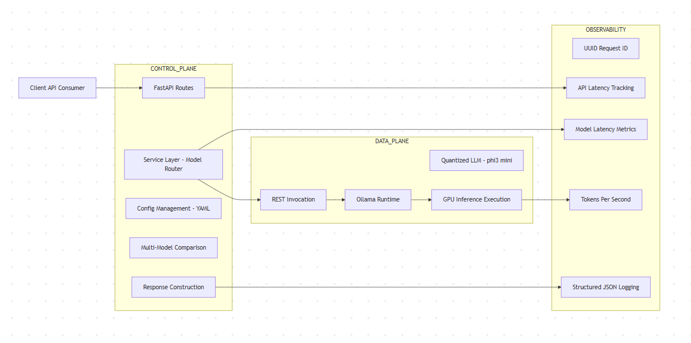

# NeuroStack

NeuroStack is a modular AI infrastructure blueprint designed for
local-first, GPU-accelerated large language model orchestration.

## Architecture Overview

NeuroStack follows a layered architecture:

-   API Gateway (FastAPI)
-   AI Control Plane (Routing + Orchestration)
-   Observability Middleware (Tracing + Metrics)
-   AI Data Plane (Ollama Runtime)
-   GPU Execution Layer

### High-Level Architecture

## Phase 3 -- Local AI Control Plane (Complete)

-   Structured FastAPI Control Plane
-   External YAML-based model configuration
-   Multi-model comparison support
-   Health endpoint
-   GPU-backed inference (Ollama)
-   Config-driven architecture

## Phase 3.1 -- Observability Enhancements (Complete)

-   Structured JSON logging
-   Global request tracing (UUID-based)
-   Latency measurement (API + Model level)
-   Token/sec throughput estimation
-   Response header traceability

### Observability Flow

------------------------------------------------------------------------

NeuroStack is designed as a professional AI systems blueprint for
engineers building scalable AI orchestration layers.
