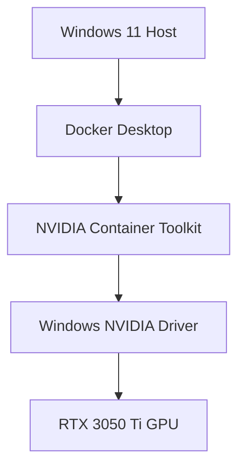

# 🏗 NVIDIA AI Control Plane (NACP)

# GPU Runtime Architecture Decision Document

## Option A vs Option B Technical Evaluation

------------------------------------------------------------------------

# 1️⃣ Purpose

This document formally evaluates two GPU runtime architecture strategies
for the NVIDIA AI Control Plane (NACP):

-   **Option A:** Native Windows + Docker Desktop + NVIDIA Toolkit
-   **Option B:** Windows 11 + WSL2 (Ubuntu) + Docker + NVIDIA Container
    Toolkit

It defines:

-   Architectural rationale
-   Performance considerations
-   Operational trade-offs
-   Enterprise alignment
-   Production parity
-   Use case applicability

------------------------------------------------------------------------

# 2️⃣ Architectural Context

NACP is a **GPU-aware AI Control Plane** requiring:

-   Deterministic CUDA execution
-   Containerized inference services
-   Reproducible runtime environments
-   Observability integration
-   Future cloud portability

Because GPU workloads are hardware-accelerated and memory-constrained,
runtime selection materially impacts architecture quality.

------------------------------------------------------------------------

# 3️⃣ Option A -- Native Windows GPU Runtime

## Architecture Overview

## Execution Flow

Container → Docker → Windows CUDA Runtime → NVIDIA Driver → GPU

## Advantages

-   Simpler initial setup
-   No additional Linux layer
-   Suitable for Windows-native AI applications
-   Good for research notebooks and experimentation
-   Lower conceptual complexity for small projects

## Architectural Limitations

-   Less alignment with Linux-based production GPU environments
-   Higher probability of CUDA/DLL compatibility edge cases
-   Reduced reproducibility across cloud GPU nodes
-   More difficult DevOps portability
-   Mixed Windows/Linux container inconsistencies

## Ideal Use Cases

-   Desktop AI tooling
-   Windows service-based AI integration
-   Local research experimentation
-   .NET + AI integration stacks
-   Non-containerized CUDA workflows

------------------------------------------------------------------------

# 4️⃣ Option B -- WSL2 Linux GPU Bridge (Recommended)

## Architecture Overview

## GPU Passthrough Mechanism

WSL2 uses **GPU Paravirtualization (GPU-PV)**.

CUDA calls inside Linux are forwarded via `/dev/dxg` device interface to
the Windows NVIDIA driver, which schedules actual GPU compute execution.

This provides near-native performance.

## Advantages

-   Mirrors production Linux GPU environments
-   Strong container reproducibility
-   Stable CUDA compatibility model
-   Clean separation of host vs runtime layers
-   Future cloud portability (AWS/Azure/GCP GPU nodes)
-   Enterprise DevOps alignment
-   Clear control-plane / data-plane boundary

## Architectural Strength

-   Production parity with Kubernetes GPU nodes
-   Deterministic container behavior
-   Lower operational drift
-   Better infrastructure storytelling for enterprise design reviews

## Ideal Use Cases

-   Enterprise AI platforms
-   Containerized inference services
-   RAG + Graph hybrid systems
-   Multi-service AI orchestration
-   GPU-aware workload routing systems
-   Infrastructure-focused AI architecture portfolios

------------------------------------------------------------------------

# 5️⃣ Performance Comparison

  Metric                  Option A      Option B
  ----------------------- ------------- -------------
  Raw GPU Throughput      Near-native   Near-native
  CUDA Overhead           Minimal       Minimal
  Production Parity       Moderate      High
  Container Portability   Moderate      High
  DevOps Alignment        Moderate      Strong
  Long-term Stability     Variable      Strong
  Reproducibility         Moderate      High

Performance difference is negligible.\
Architectural quality difference is significant.

------------------------------------------------------------------------

# 6️⃣ Enterprise Decision Rationale

Option B was selected for NACP because:

1.  It mirrors Linux production GPU clusters.
2.  It strengthens reproducibility and disaster recovery strategy.
3.  It reduces Windows-specific CUDA operational risks.
4.  It improves architectural narrative for enterprise AI
    infrastructure.
5.  It enables smoother future migration to cloud GPU nodes.

The decision is architectural --- not benchmark-driven.

------------------------------------------------------------------------

# 7️⃣ Risk Assessment

## Option A Risks

-   Driver conflicts
-   Mixed runtime inconsistencies
-   Reduced portability

## Option B Risks

-   Requires WSL2 setup
-   Shared GPU resource contention with host OS
-   Slightly more layered infrastructure complexity

For enterprise AI orchestration systems, Option B risks are acceptable
and manageable.

------------------------------------------------------------------------

# 8️⃣ Final Recommendation

For NVIDIA AI Control Plane (NACP):

**Option B -- WSL2 Linux GPU Bridge is the preferred architecture.**

It provides:

-   Production-aligned runtime model
-   Stable containerized CUDA execution
-   Strong DevOps reproducibility
-   Enterprise-grade infrastructure narrative
-   Long-term scalability alignment

------------------------------------------------------------------------

End of GPU Runtime Architecture Decision Document
