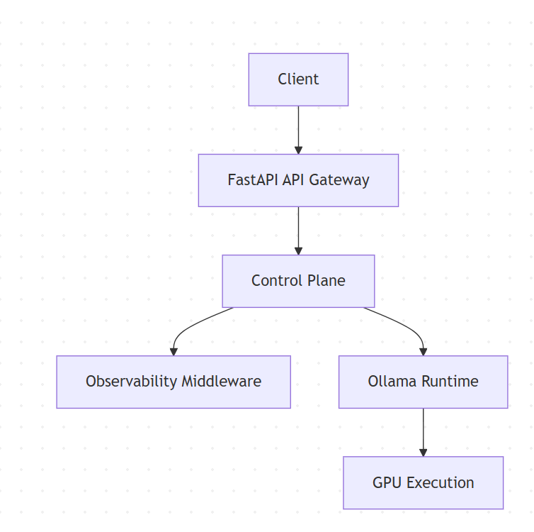
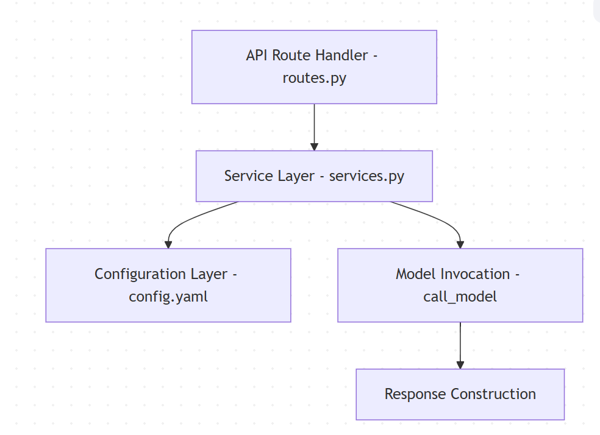
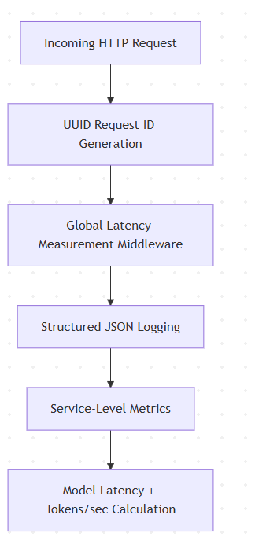
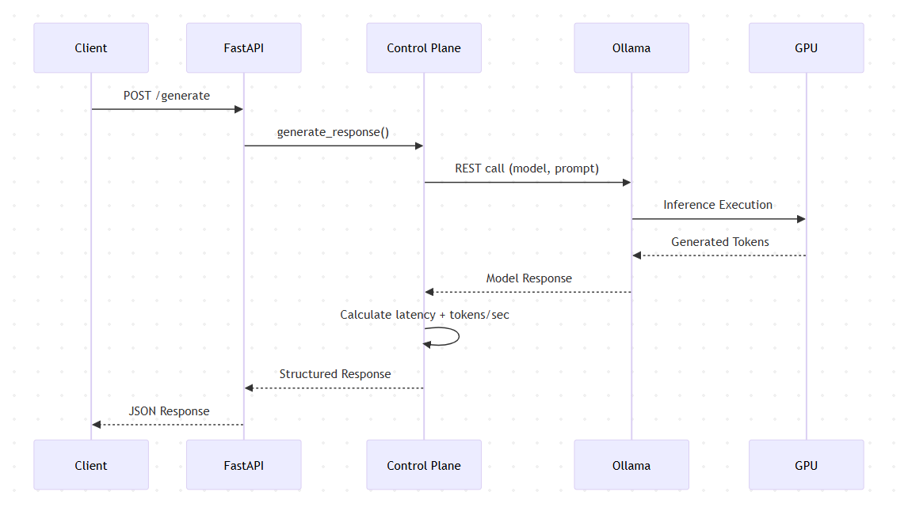

# NeuroStack Technical Design

## 1. System Architecture

NeuroStack separates concerns into clearly defined layers:

-   API Gateway Layer
-   Control Plane Layer
-   Observability Layer
-   AI Data Plane
-   GPU Runtime

------------------------------------------------------------------------

## 2. Control Plane Responsibilities

-   Model routing
-   Config-driven model management
-   Latency tracking
-   Error handling
-   API contract enforcement

------------------------------------------------------------------------

## 3. Observability Architecture

Observability is implemented as middleware within the API layer and
service-level logging within the control plane.

-   Request ID generation
-   Global latency tracking
-   Model latency measurement
-   Token throughput estimation
-   JSON structured logs

------------------------------------------------------------------------

## 4. Model Execution Pipeline

The AI Data Plane is responsible for inference execution and GPU-backed
token generation.

------------------------------------------------------------------------

## 5. Deployment Model

-   Local-first deployment (WSL2)
-   GPU-accelerated inference
-   Docker-ready structure
-   Config-driven environment separation

------------------------------------------------------------------------

## 6. Future Extensions

-   RAG Layer (pgvector + Neo4j)
-   Distributed model routing
-   Advanced GPU telemetry
-   Production-grade monitoring stack integration

------------------------------------------------------------------------

Phase 3 -- Control Plane: COMPLETE\
Phase 3.1 -- Observability: COMPLETE
